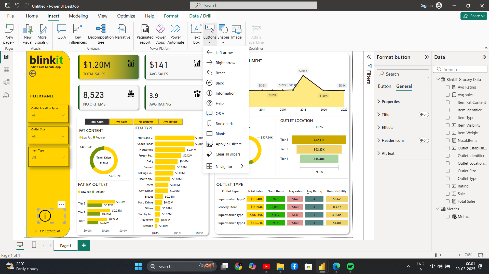

# powerbi-blinkit-analysis
An interactive Power BI dashboard analyzing Blinkit's sales performance, outlet distribution, and item categories. Features custom filter panels, KPIs, and dynamic visual storytelling for business insights.
# 🛒 Blinkit Power BI Dashboard

A professional Power BI dashboard project showcasing key business insights for **Blinkit**, a last-minute grocery delivery app in India. This dashboard provides a comprehensive view of sales performance, outlet segmentation, product category trends, and customer ratings — all in a sleek and interactive layout.

---

## 📈 Overview

This report enables decision-makers to monitor and evaluate:

- 💰 **Total Sales:** $1.20M
- 📦 **Number of Items Sold:** 8,523
- ⭐ **Average Rating:** 3.9
- 📊 **Average Sales per Item:** $141

All data is segmented by outlet type, location tier, item categories, fat content, and customer engagement metrics.

---

## 🔍 Key Visuals and Insights

- **KPI Cards** – Showcasing total sales, item volume, average rating, and sales per item.
- **Donut Charts** – Breakdown of outlet size and fat content across sales.
- **Bar Charts** – Item-level sales distribution and performance by outlet tiers.
- **Line Graph** – Trend of outlet establishments over time.
- **Matrix Table** – Detailed comparison of outlet types on sales, item visibility, and ratings.
- **Slicer Panel** – Filter by outlet location, outlet size, and item types dynamically.

---

## 📂 File Contents

- `fblinkit.pbix` – Power BI project file (if included).
- `dashboard.png` – Dashboard screenshot.
- `README.md` – Project documentation.

---
## 📊 Dataset

The dataset used in this dashboard is included in the repository as an Excel file:

📂 `data/Blinkit_Grocery_Data.xlsx`

This Excel workbook contains sales and item-level data for a simulated grocery delivery business. It includes fields such as:

- `Item_Identifier`
- `Item_Type`
- `Item_Fat_Content`
- `Item_Visibility`
- `Item_MRP`
- `Outlet_Identifier`
- `Outlet_Establishment_Year`
- `Outlet_Size`
- `Outlet_Location_Type`
- `Outlet_Type`
- `Item_Outlet_Sales`

These fields are used throughout the dashboard to calculate KPIs, drive visualizations, and enable dynamic filtering.

## 💡 Use Case

Ideal for:

- Business Intelligence projects
- Retail sales analytics
- Portfolio showcasing Power BI skills
- Learning data storytelling and visualization best practices

---

## 🛠 Tools Used

- **Power BI Desktop**
- Custom visuals and slicers
- Conditional formatting for performance highlights
- Simulated dataset ("BlinkIT Grocery Data" and "Metrics")

---

## 📌 How to Use

1. Clone or download the repository.
2. Open the `.pbix` file using Power BI Desktop.
3. Interact with the slicers and visuals to explore the data insights.
4. Use the clear slicers button to reset the view.

---

## ⚠️ Disclaimer

> This dashboard is created for educational and portfolio purposes. It is not affiliated with or endorsed by Blinkit. The data is mock/sample data meant for demonstration only.

---

